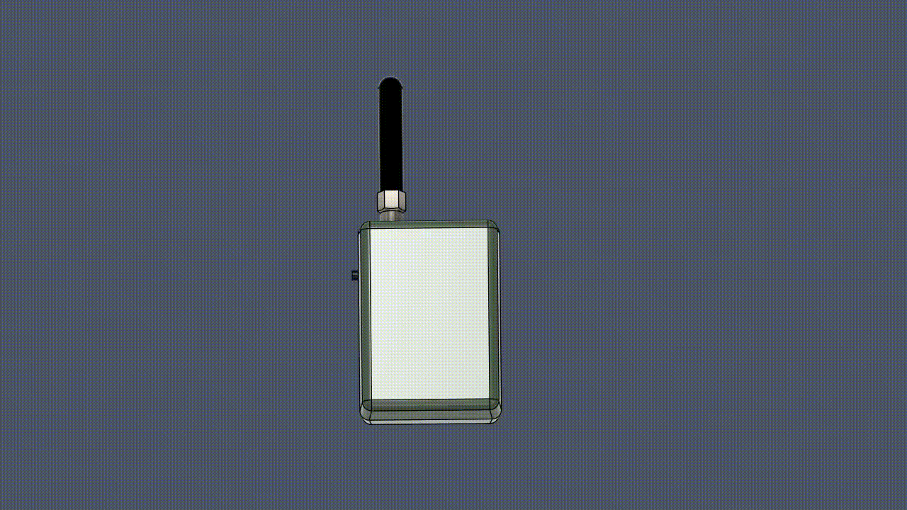

# Проект на хакатон SmaRTF

### Повністю мною розроблені 3Д моделі у Fusion 360

Наш проект - це пристрій для пошуку будь-якого об'єкту, до якого прикріплений маячок.  
  
Радіус дії - 500 м  
Автономність - 1 день активної роботи
  
Пеленгатор складається з заводської алюмінієвої антени діапазону 824–960 МГц та надрукованого на 3Д принтері корпуса  

Все працює на ардуїнках з радіомодулем RFM69HW  

UPD: Ми взяли з цим проектом 3 місце, він справді дешевий та корисний

Ще трохи фоток:

Цей хакатон подарував мені незабутні враження та безцінний досвід
